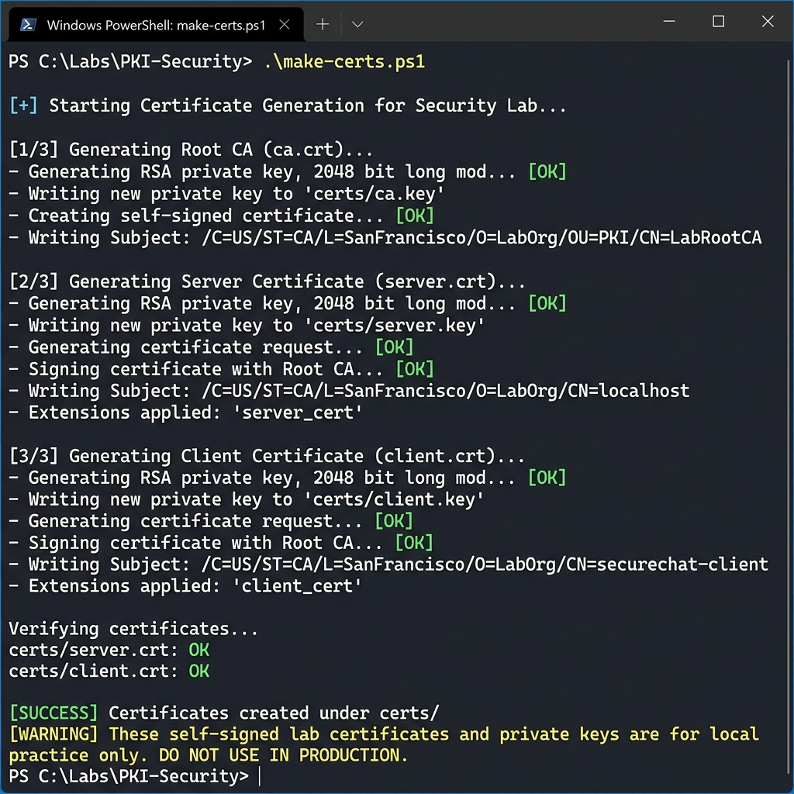
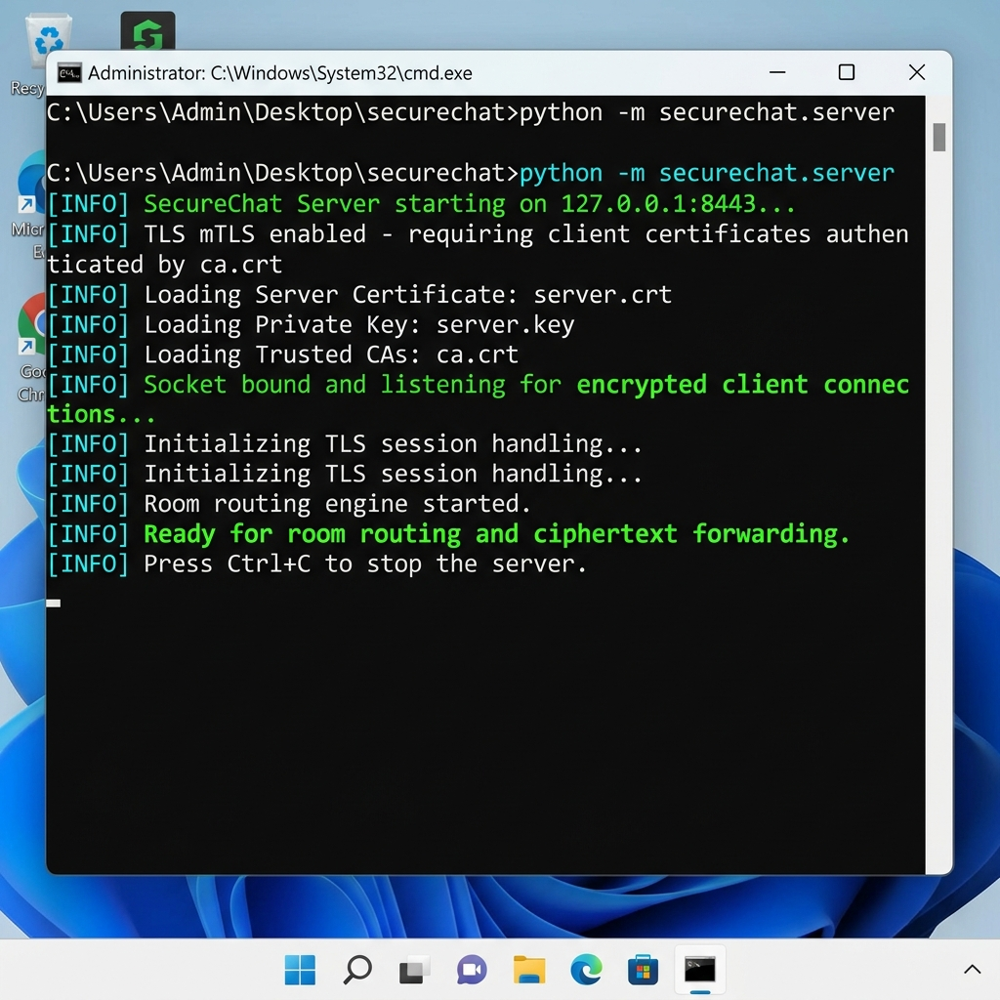
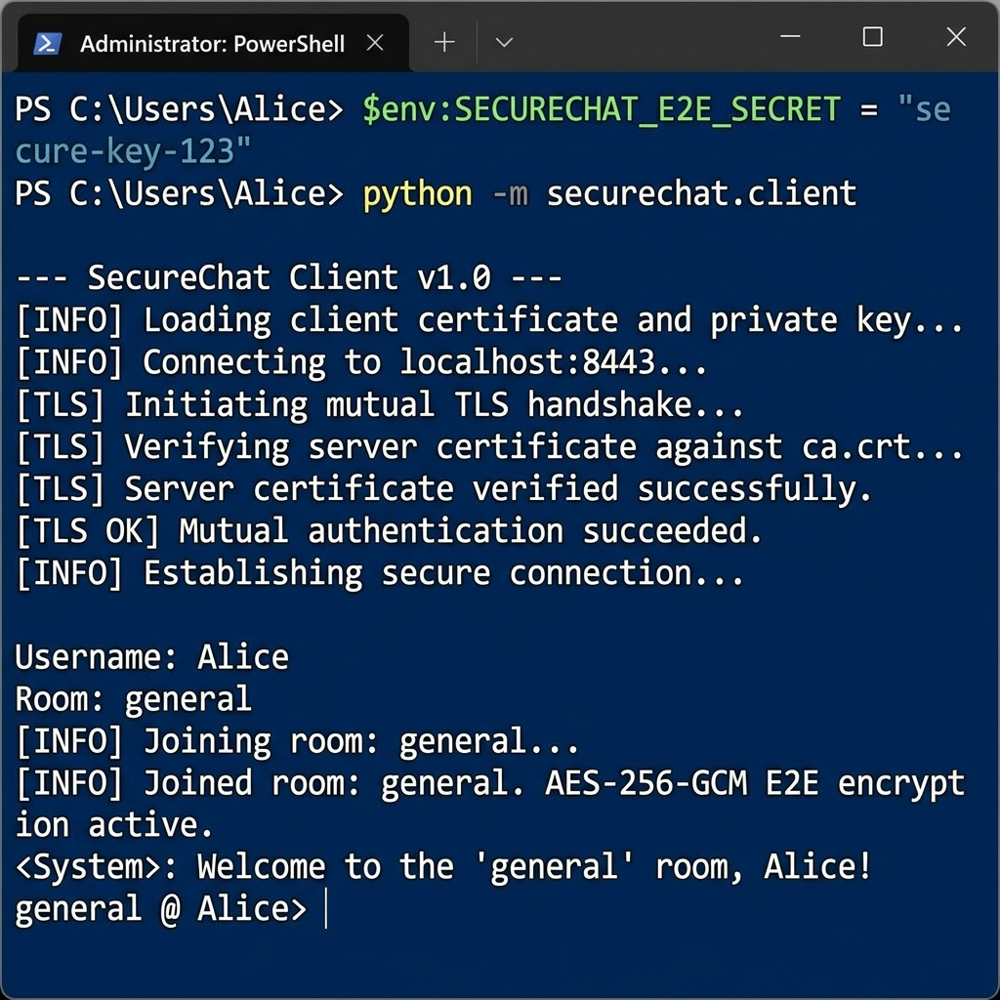
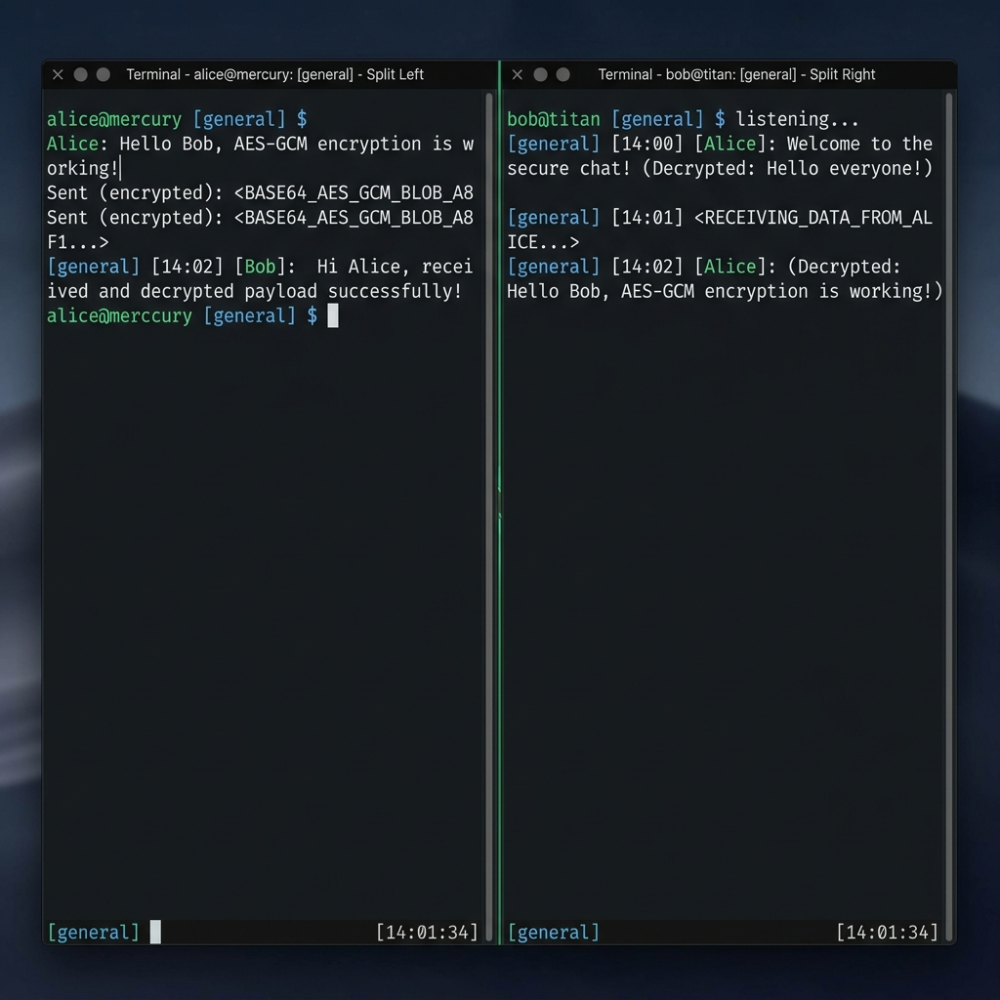
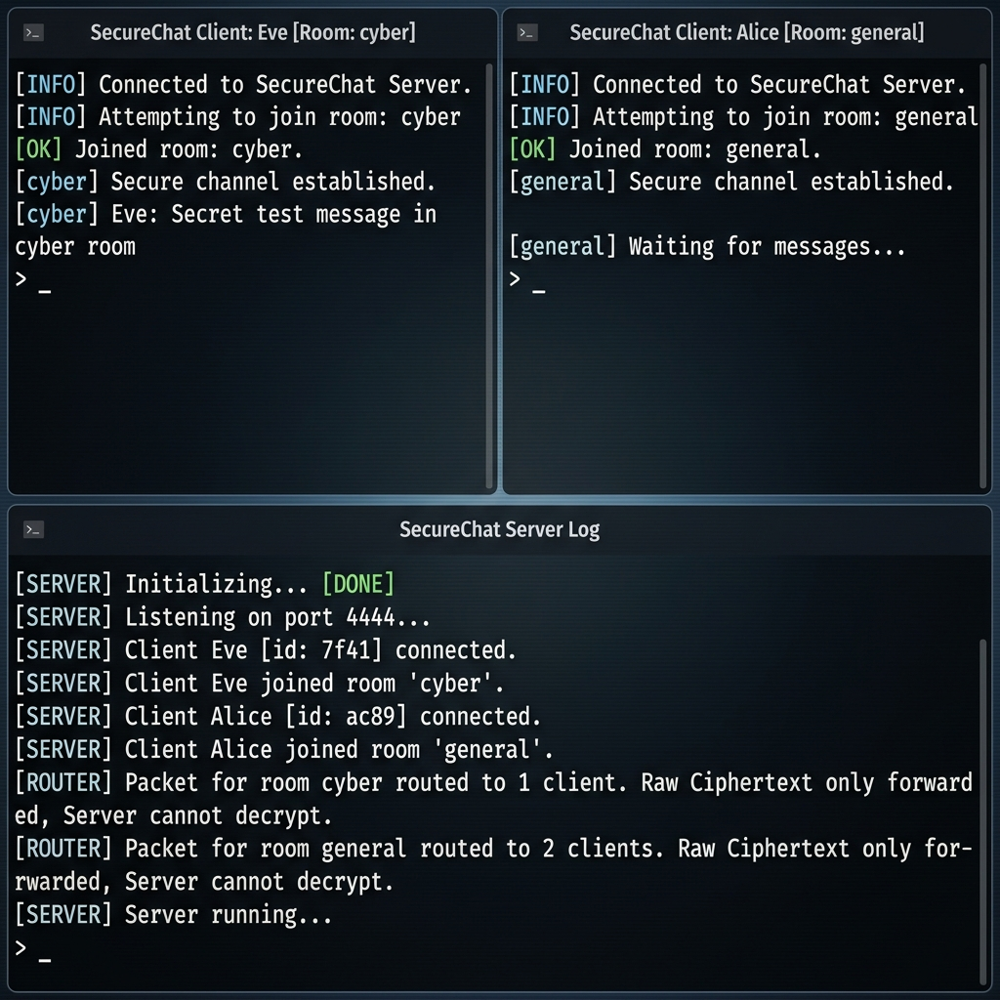

# Bài 3: Bảo mật Mạng máy tính & Ứng dụng Bán an toàn

Tài liệu hướng dẫn chi tiết và báo cáo thực hành cho Bài 3, gồm 2 bài Lab với đầy đủ hình ảnh demo từng bước hiển thị trực tiếp bên dưới.

---

## 1. 🔒 [Lab 1 - SecureChat](lab1/README.md)

* **Mục tiêu**: Xây dựng chat TCP đa luồng với TLS hai chiều (mTLS), xác minh Root CA, phân phòng và mã hóa đầu-cuối AES-256-GCM.
* **Chi tiết từng bước**: Xem thêm tại [Tài liệu Lab 1](lab1/README.md).

### 📸 Hình ảnh Demo trực quan Lab 1:

#### Bước 1: Phát hành chứng chỉ TLS x509 hai chiều (mTLS)


#### Bước 2: Khởi chạy SecureChat TLS Server


#### Bước 3: Client A đăng nhập & thiết lập E2E Key


#### Bước 4: Client B trao đổi tin nhắn mã hóa E2E


#### Bước 5: Thử nghiệm cách ly phòng chat


---

## 2. 🛡️ [Lab 2 - NetRecon](lab2/README.md)

* **Mục tiêu**: Xây dựng công cụ kiểm kê TCP Service trên địa chỉ IP private/loopback được ủy quyền với ràng buộc an toàn (Scope authorization, Rate limiting, Audit logging).
* **Chi tiết từng bước**: Xem thêm tại [Tài liệu Lab 2](lab2/README.md).

### 📸 Hình ảnh Demo trực quan Lab 2:

#### Bước 1: Kiểm kê TCP Service qua CLI


#### Bước 2: Kiểm thử cơ chế từ chối truy cập trái phép


#### Bước 3: Giao diện Web UI NetRecon


#### Bước 4: Kết quả scan trực quan trên Web UI


#### Bước 5: Nhật ký ghi vết kiểm toán (Audit Log)


---

## 🧪 Kiểm thử tự động (Unit Tests)

Cả 2 bài Lab đều đạt **100% test cases** thành công:
```powershell
# Kiểm thử Lab 1
python -m pytest "Bài 3/lab1/tests" -q

# Kiểm thử Lab 2
python -m pytest "Bài 3/lab2/tests" -q
```


