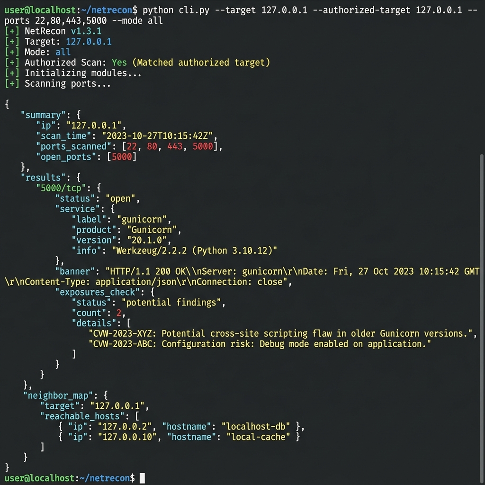
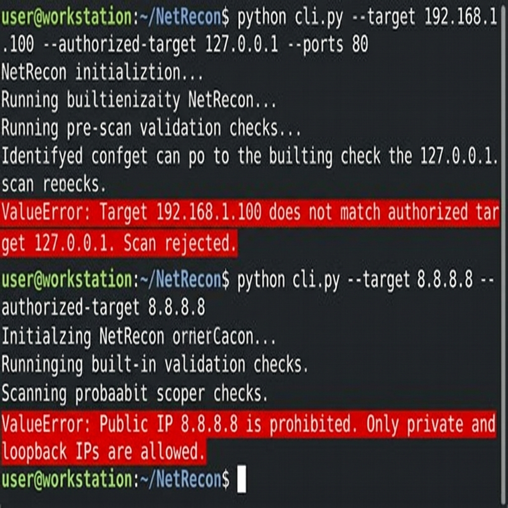
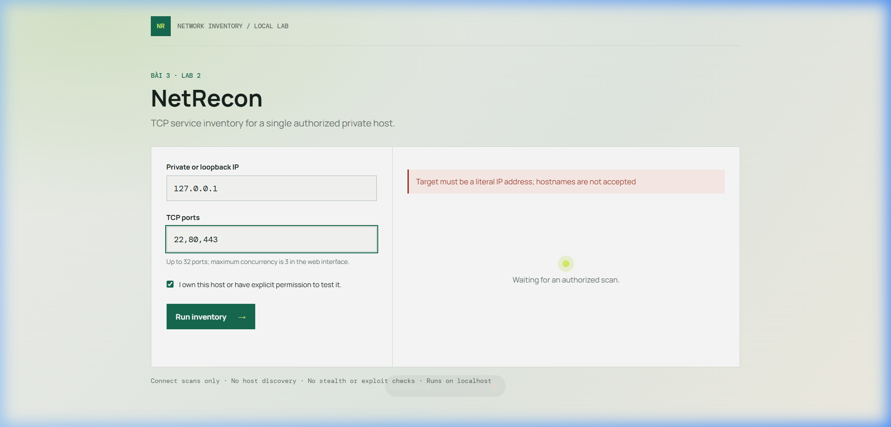
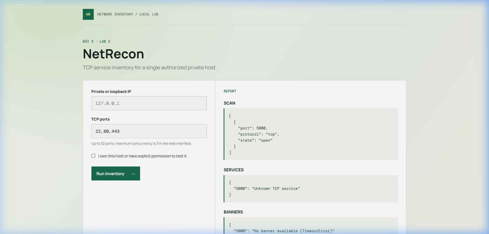
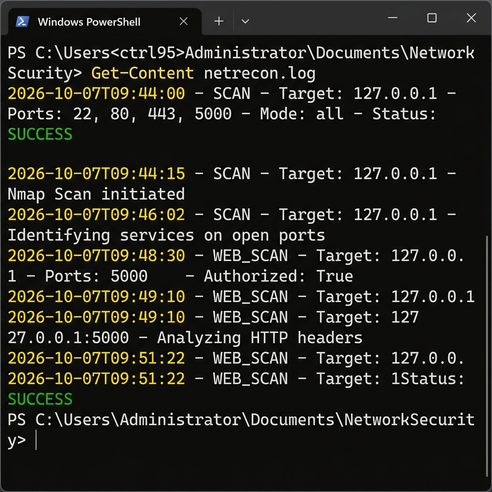

# Bài 3 - Lab 2: NetRecon

## Phạm vi & An toàn

Công cụ học tập để kiểm kê TCP trên **một địa chỉ IP private/loopback** mà người chạy sở hữu hoặc được cho phép kiểm tra. Mỗi lệnh yêu cầu lặp lại chính xác IP ở `--authorized-target`; hostname, IP public và dải quét đều bị từ chối. Tối đa 32 cổng/lần, concurrency CLI tối đa 5 (web tối đa 3). Tất cả scan được ghi timestamp vào `netrecon.log`.

Bản này chủ ý không triển khai SYN/UDP/stealth, quét subnet, khai thác, hoặc nhận diện CVE/version. `service_detector` chỉ gắn nhãn dịch vụ phổ biến theo port; `vuln_checker` chỉ nêu lưu ý phơi lộ FTP/Telnet, không khẳng định tìm thấy CVE. `network_mapper` chỉ đọc neighbor cache cục bộ (`arp -a`), không dò host. Không cần Nmap hay tài khoản/email SMTP.

## Cài đặt & Kiểm tra

1. Mở PowerShell tại `Bài 3/lab2`.
2. Tạo môi trường ảo và cài dependency:
   ```powershell
   python -m venv .venv
   .\.venv\Scripts\Activate.ps1
   python -m pip install -r requirements.txt
   ```
3. Chạy test tự động: `python -m pytest -q`.

---

## Hướng dẫn từng bước & Chạy Demo (Step-by-Step Demo)

### Bước 1: Kiểm kê TCP Service qua giao diện dòng lệnh (CLI)

Chạy lệnh quét trên IP loopback hoặc IP private của máy bạn với đầy đủ tham số xác nhận `--authorized-target`:

```powershell
python cli.py --target 127.0.0.1 --authorized-target 127.0.0.1 --ports 22,80,443,5000 --mode all
```

Kết quả trả về dưới dạng JSON cấu trúc bao gồm trạng thái quét cổng (open / closed_or_filtered), nhận diện dịch vụ, thu thập banner và ghi chú phơi lộ an toàn.



---

### Bước 2: Kiểm thử Cơ chế Scope Authorization & Bảo mật

Thử nghiệm các trường hợp vi phạm phạm vi an toàn để xác minh cơ chế chặn chủ động:
1. Thiếu tham số `--authorized-target` hoặc target không khớp:
   ```powershell
   python cli.py --target 127.0.0.1 --authorized-target 192.168.1.1
   ```
2. Nhập IP public (ví dụ: `8.8.8.8`) hoặc hostname:
   ```powershell
   python cli.py --target 8.8.8.8 --authorized-target 8.8.8.8
   ```

Hệ thống đưa ra ngoại lệ `ValueError` và dừng scan ngay lập tức để ngăn chặn quét trái phép.



---

### Bước 3: Khởi chạy Giao diện Web UI NetRecon

Khởi chạy ứng dụng Web Flask chỉ bind trên interface loopback (`127.0.0.1:5000`):

```powershell
python app.py
```

Truy cập `http://127.0.0.1:5000/` trên trình duyệt. Giao diện hiển thị form cấu hình scan với trường nhập IP, Ports và checkbox bắt buộc xác nhận quyền sở hữu/cho phép (Consent Checkbox).



---

### Bước 4: Chạy Scan & Xem Báo cáo Trực quan trên Web UI

Nhập `127.0.0.1`, các cổng `22, 80, 443, 5000`, tích chọn xác nhận quyền và nhấn **Run inventory →**:

Hệ thống thực hiện quét async và trả về báo cáo phân loại rõ ràng:
- **Scan**: Trạng thái chi tiết từng port.
- **Services**: Nhãn dịch vụ tương ứng.
- **Banners**: Thông tin banner thu thập được từ cổng open.
- **Exposures**: Cảnh báo rủi ro phơi lộ.



---

### Bước 5: Ghi vết Nhật ký Kiểm toán System Audit Log

Mọi thao tác quét từ CLI lẫn Web UI đều được ghi vết tự động vào file nhật ký `netrecon.log` phục vụ mục đích kiểm toán an toàn thông tin:

```powershell
Get-Content netrecon.log -Tail 10
```

Mỗi dòng nhật ký bao gồm timestamp ISO, target IP, danh sách port, mode quét và trạng thái thực thi.



---

## Báo cáo thực hiện

- **Thiết kế mô-đun hóa**: Tách biệt rõ ràng giữa `port_scanner`, `banner_grabber`, `service_detector`, `vuln_checker`, `network_mapper`, `scope` và `audit_logger`.
- **Ràng buộc an toàn**: Đảm bảo strict authorization, giới hạn IP private/loopback, giới hạn 32 port và rate-limiting chống quá tải.
- **Tích hợp đa nền tảng**: Cung cấp cả giao diện dòng lệnh (CLI) linh hoạt lẫn giao diện web trực quan (Flask UI).

Chỉ dùng với thiết bị và mạng đã được cho phép. Kết quả connect scan là `open` hoặc `closed_or_filtered`, không thể phân biệt chắc chắn cổng đóng với firewall lọc gói.

